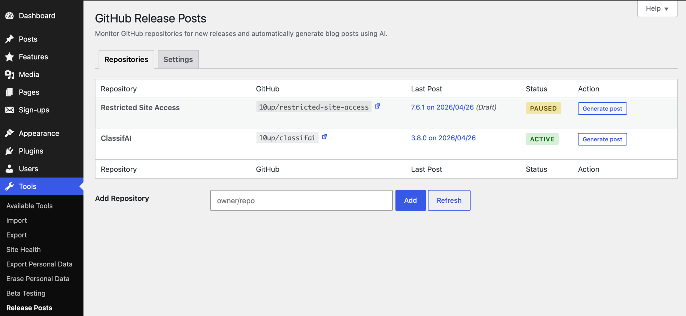
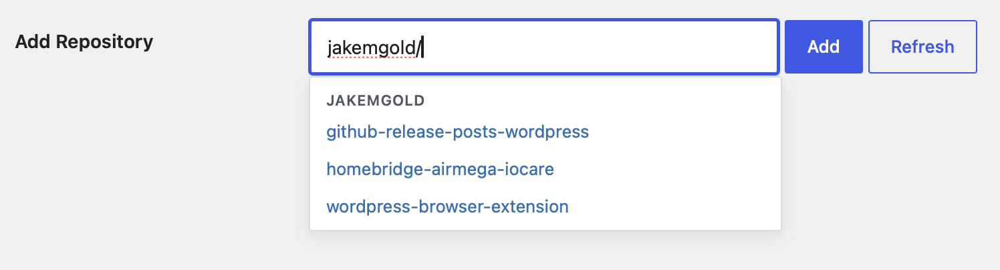
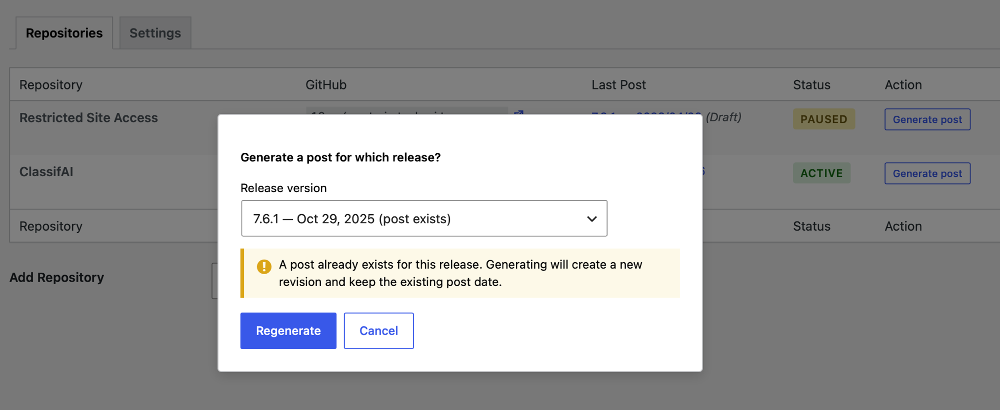

# GitHub Release Posts

**Automatically generate blog posts from GitHub releases using AI.**

A WordPress plugin that monitors GitHub repositories for new releases and uses AI to generate human-readable blog posts from release notes. Posts can be automatically published or held as drafts for review, with email notifications when new posts are ready.

## How it works

1. **Monitor** — Add any GitHub repository and the plugin checks for new releases daily via WP-Cron.
2. **Generate** — When a new release is detected, the AI reads the release notes and writes a blog post tailored to your audience.
3. **Publish** — Posts are created as drafts for review, or published automatically based on your per-repository settings.

You can also generate a post on demand at any time from the Repositories tab.

## Screenshots

### Repositories tab
Monitor multiple GitHub repos with last post version, status, and one-click post generation.



### Settings tab
Configure your AI provider, API key, audience level, custom prompt instructions, and notifications.



### Inline editing
Per-repo settings including name, project link, post status, author, categories, tags, and featured image — following the familiar WordPress Quick Edit pattern.



### Generated post in the block editor
AI-written content with embedded images, plus the GitHub Release sidebar panel for source attribution and regeneration.


## Features

- Monitor multiple GitHub repositories for new releases
- AI-powered post generation with three provider options:
  - **OpenAI** (o3) — direct API key connection
  - **Anthropic** (Claude Opus 4.6) — direct API key connection
  - **WordPress AI Client** (experimental) — uses the WordPress core AI infrastructure
- Significance-aware content — patch, minor, major, and security releases get tailored tone and structure
- SEO-friendly post slugs and excerpts generated automatically by AI
- Configurable publish/draft workflow with per-repository overrides
- Per-repository post defaults (categories, tags, post status, author, featured image)
- Custom prompt instructions to guide AI writing style, tone, and voice
- Regenerate posts with feedback — refine AI output directly from the block editor sidebar
- Email notifications on draft creation, publication, or both
- Source attribution in the block editor — see which GitHub release generated each post
- Idempotency — the same release never creates duplicate posts
- Optional project link support — enter a URL or WordPress.org slug for download CTAs
- Optional AI disclosure note appended to generated posts

## Requirements

- WordPress 6.9 or later
- PHP 8.2 or later
- An AI provider: an OpenAI API key, an Anthropic API key, or the WordPress AI Client (WordPress 7.0+)

## Installation

1. Download the latest release zip from [Releases](../../releases).
2. In WordPress admin, go to **Plugins → Add New → Upload Plugin** and upload the zip.
3. Activate the plugin.
4. Go to **Tools → Release Posts** to configure your AI provider and add repositories.

## For developers

### Filters

The plugin is extensible via filter hooks at every stage of the pipeline:

| Filter | Purpose |
|--------|---------|
| `ctbp_default_post_status` | Default status when creating a repo (default: `draft`) |
| `ctbp_default_categories` | Default categories for new repos |
| `ctbp_default_tags` | Default tags for new repos |
| `ctbp_post_status_options` | Post status dropdown choices |
| `ctbp_post_status` | Override status per-release before it's applied |
| `ctbp_post_terms` | Override categories/tags per-release |
| `ctbp_post_featured_image` | Override featured image per-release |
| `ctbp_ai_disclosure_text` | Customize or suppress the AI disclosure note |
| `ctbp_max_release_body_length` | Truncation threshold for large release bodies |
| `ctbp_sideload_allowed_domains` | Domains allowed for image sideloading |
| `ctbp_check_frequency` | WP-Cron schedule (default: `daily`) |
| `ctbp_register_ai_providers` | Register custom AI provider connectors |
| `ctbp_openai_model` | Override OpenAI model ID |
| `ctbp_anthropic_model` | Override Anthropic model ID |
| `ctbp_generate_prompt` | Full prompt customization |
| `ctbp_release_body` | Filter release body before prompt building |

### Custom AI providers

Register a custom provider by implementing `AIProviderInterface` and hooking into `ctbp_register_ai_providers`:

```php
add_filter( 'ctbp_register_ai_providers', function( $providers ) {
    $providers['my_provider'] = new My_Custom_Provider();
    return $providers;
} );
```

### Development

```bash
npm start                # Dev build with watch
npm run build            # Production build
composer install          # Install PHP dependencies
composer test             # Run PHPUnit tests
vendor/bin/phpcs --standard=phpcs.xml.dist includes/  # WPCS lint
```

## License

GPL-2.0-or-later. See [LICENSE](https://www.gnu.org/licenses/gpl-2.0.html).

## Credits

Built by [Jake Goldman](https://www.linkedin.com/in/jacobgoldman/), Fueled (formerly 10up).
