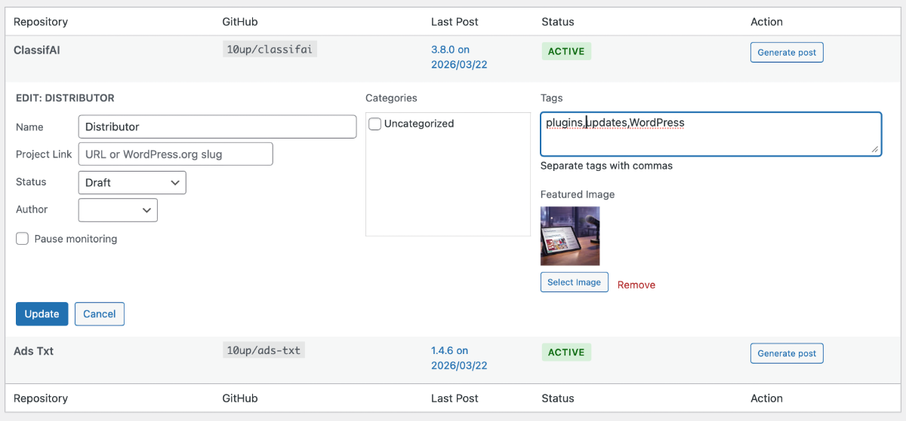
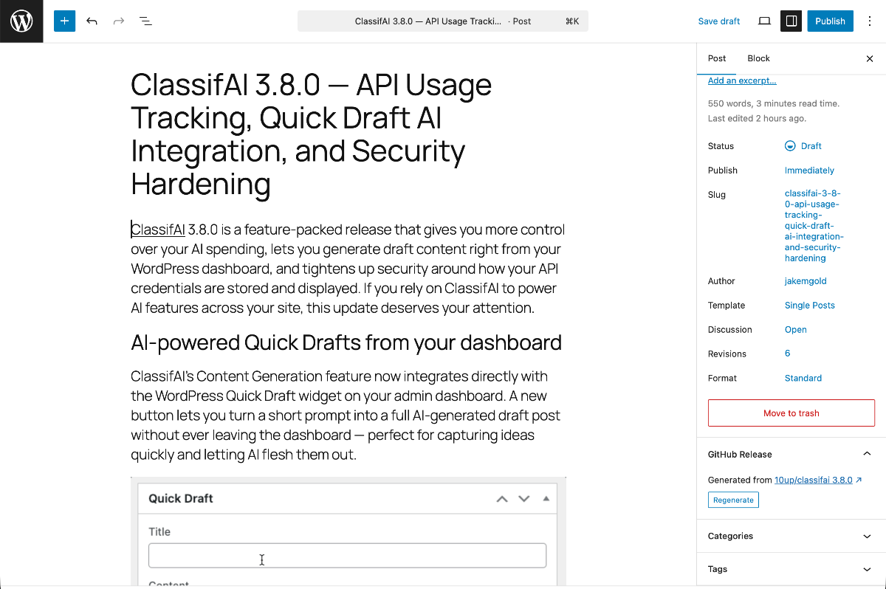

# Auto Release Posts for GitHub — WordPress Plugin

**A WordPress plugin that automatically generates blog posts from GitHub releases using AI.**

Monitors GitHub repositories for new releases and uses AI to research each release and generate a human-readable blog post about it. Posts can be automatically published or held as drafts for review, with email notifications when new posts are ready.

Built on the **[AI Client API and Connectors](https://make.wordpress.org/core/2026/05/14/wordpress-7-0-field-guide/#ai-connectors-screen)** introduced in WordPress 7.0 — configure your AI provider (Anthropic, OpenAI, Google, or any other connector) once under Settings → Connectors, and this plugin uses whatever you've set up. No AI API keys to manage in the plugin itself.

Built by [Jake Goldman](https://www.linkedin.com/in/jacobgoldman/), founder of [10up](https://10up.com), and now a Partner / Advisor at [Fueled](https://fueled.com) since the [merger with 10up](https://10up.com/blog/2025/new-fueled-brand-10up-becomes-wordpress-practice/).

## How it works

1. **Monitor** — Add any GitHub repository and the plugin checks for new releases daily via WP-Cron.
2. **Generate** — When a new release is detected, the AI researches the release and writes a blog post tailored to your audience.
3. **Publish** — Posts are created as drafts for review, or published automatically based on your per-repository settings.

You can also generate a post on demand at any time from the Repositories tab.

## Screenshots

### Repositories tab
Monitor multiple GitHub repos with last post version, status, and one-click post generation.


### Repository autocomplete
With a GitHub Personal Access Token configured, the Add Repository field suggests from the repositories your token can access, grouped by owner. You can still type any public `owner/repo` to track a repository that isn't in the list.


### Release picker
Generating a post manually lets you pick any historical release, not just the latest. If a post already exists for the selected release, an inline warning surfaces — regenerating creates a new revision and preserves the existing post date so the archive stays in chronological order.


### Settings tab
View your AI connector status and configure audience level, custom prompt instructions, and notifications.


### Inline editing
Per-repo settings including name, project link, post status, author, categories, tags, and featured image — following the familiar WordPress Quick Edit pattern.



### Generated post in the block editor
AI-written content with embedded images, plus the GitHub Release sidebar panel for source attribution and regeneration.



## Features

- Monitor multiple GitHub repositories for new releases
- AI-powered post generation via WordPress Connectors — works with Anthropic, OpenAI, Google, and any other configured connector
- Significance-aware content — patch, minor, major, and security releases get tailored tone and structure
- Choose the research depth — Standard reviews release notes, linked issues and PRs, metadata, and the README; Deep adds commit messages and file changes since the last release
- SEO-friendly post slugs and excerpts generated automatically by AI
- Configurable publish/draft workflow with per-repository overrides
- Per-repository post defaults (categories, tags, post status, author, featured image)
- Choose your post title format — prefix with project name and version, version only, or no auto-prefix (let the AI write the full title in single-project sites)
- Generate posts on demand for any historical release — pick from a version dropdown when a repo has multiple releases; older releases are automatically backdated to keep the archive in chronological order
- Custom prompt instructions to guide AI writing style, tone, and voice
- Regenerate posts with feedback — refine AI output directly from the block editor sidebar
- Email notifications on draft creation, publication, or both
- Source attribution in the block editor — see which GitHub release generated each post
- Idempotency — the same release never creates duplicate posts
- Optional project link support — enter a URL or WordPress.org slug for download CTAs
- Optional pre-release tracking per repository (off by default)
- Optional AI disclosure note appended to generated posts

## Requirements

- WordPress 7.0 or later
- PHP 8.2 or later
- At least one AI connector configured under Settings → Connectors (Anthropic, OpenAI, or Google recommended)

## Installation

### From a release zip

1. Download the latest release zip from [Releases](../../releases).
2. In WordPress admin, go to **Plugins → Add New → Upload Plugin** and upload the zip.
3. Activate the plugin.
4. Go to **Tools → Release Posts** to configure your AI provider and add repositories.

### With Composer

Composer-managed WordPress sites (Roots/Bedrock and similar) can install the plugin from [Packagist](https://packagist.org/packages/github-release-posts/github-release-posts):

```bash
composer require github-release-posts/github-release-posts
```

This assumes your project uses [composer/installers](https://github.com/composer/installers) and routes WordPress plugins to `wp-content/plugins/`. If it doesn't, add this to your project's `composer.json`:

```json
{
    "require": {
        "composer/installers": "^2.0"
    },
    "extra": {
        "installer-paths": {
            "wp-content/plugins/{$name}/": ["type:wordpress-plugin"]
        }
    }
}
```

Activate the plugin in WordPress admin as usual, then go to **Tools → Release Posts**.

## GitHub access

The plugin uses a GitHub Personal Access Token (PAT) to read release data. A PAT is optional for public repositories — without one, GitHub limits the plugin to 60 API requests per hour. Adding a PAT raises that to 5,000 per hour, replaces the "owner/repo" text field with a dropdown of repositories the token can access, and is required to access private repositories. The Settings page shows a green check once GitHub confirms the token.

<details>
<summary><strong>Create a fine-grained PAT and add it to WordPress</strong></summary>

A fine-grained token can be scoped to a single user or organization and to specific repositories — ideal for a "service account" that monitors a known set of releases.

1. Go to [github.com/settings/personal-access-tokens/new](https://github.com/settings/personal-access-tokens/new).
2. **Token name** — something descriptive, e.g. `My Site — Auto Release Posts for GitHub`.
3. **Expiration** — pick a value that fits your security policy.
4. **Resource owner** — choose your user account or an organization you belong to.
5. **Repository access** — choose **Only select repositories** and pick the repos you want to monitor. (Or **All repositories** if you'd rather not maintain the list here.)
6. **Repository permissions** — set all four to **Read-only**:
   - **Contents** — required for releases and commit comparisons.
   - **Metadata** — required (auto-selected).
   - **Issues** — used during AI prompt enrichment.
   - **Pull requests** — used during AI prompt enrichment.
7. Click **Generate token** and copy the `github_pat_…` value immediately — GitHub won't show it again.
8. Provide the token to the plugin in one of two ways:
   - **Environment variable or constant (recommended)** — define `GITHUB_RELEASE_POSTS_PAT` as an environment variable or as a PHP constant in `wp-config.php`. The plugin reads the constant first, then the env var, then the database. When set this way, the value never lives in the WordPress database, and the Settings field becomes read-only.
   - **WordPress admin** — go to **Tools → Release Posts → Settings**, paste the token into the **Personal Access Token** field, and click **Save Settings**.

</details>

## For developers

### Filters

The plugin is extensible via filter hooks at every stage of the pipeline:

| Filter | Purpose |
|--------|---------|
| `ghrp_default_post_status` | Default status when creating a repo (default: `draft`) |
| `ghrp_default_categories` | Default categories for new repos |
| `ghrp_default_tags` | Default tags for new repos |
| `ghrp_post_status_options` | Post status dropdown choices |
| `ghrp_post_status` | Override status per-release before it's applied |
| `ghrp_post_title` | Override the final post title (after format prefixing) |
| `ghrp_post_terms` | Override categories/tags per-release |
| `ghrp_post_featured_image` | Override featured image per-release |
| `ghrp_ai_disclosure_text` | Customize or suppress the AI disclosure note |
| `ghrp_max_release_body_length` | Truncation threshold for large release bodies |
| `ghrp_sideload_allowed_domains` | Domains allowed for image sideloading |
| `ghrp_check_frequency` | WP-Cron schedule (default: `daily`) |
| `ghrp_register_ai_providers` | Register custom AI provider connectors |
| `ghrp_wp_ai_client_model_preferences` | Ordered list of preferred model IDs for WordPress Connectors |
| `ghrp_openai_reasoning_effort` | Reasoning effort level for OpenAI models (default: `high`) |
| `ghrp_generate_prompt` | Full prompt customization |
| `ghrp_release_body` | Filter release body before prompt building |

### Development

```bash
npm start                # Dev build with watch
npm run build            # Production build
composer install          # Install PHP dependencies
composer test             # Run PHPUnit tests
vendor/bin/phpcs --standard=phpcs.xml.dist includes/  # WPCS lint
```

## Contributors

- [Ben Word](https://github.com/retlehs) ([Roots](https://roots.io)) — GitHub repository picker and external PAT configuration ([#2](https://github.com/jakemgold/github-release-posts-wordpress/pull/2))
- [Thorsten Ott](https://github.com/tott) ([Fueled](https://fueled.com), formerly 10up) — Engineering review feedback

## License

GPL-2.0-or-later. See [LICENSE](https://www.gnu.org/licenses/gpl-2.0.html).

## Trademarks

Auto Release Posts for GitHub is an independent project. It is not affiliated with, endorsed by, or sponsored by GitHub, Inc. or the WordPress Foundation. "GitHub" and "WordPress" are used here for descriptive purposes only.

## Like what you see?

<a href="http://10up.com/contact/"></a>
